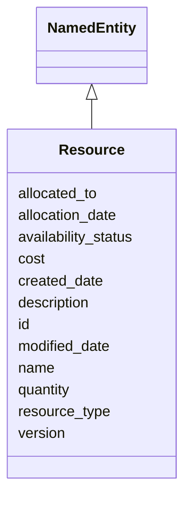

```mermaid
 classDiagram
    class Resource
    click Resource href "../Resource"
      NamedEntity <|-- Resource
        click NamedEntity href "../NamedEntity"
      
      Resource : allocated_to
        
      Resource : allocation_date
        
      Resource : availability_status
        
      Resource : cost
        
      Resource : created_date
        
      Resource : description
        
      Resource : id
        
      Resource : modified_date
        
      Resource : name
        
      Resource : quantity
        
      Resource : resource_type
        
      Resource : version
        
      
```
