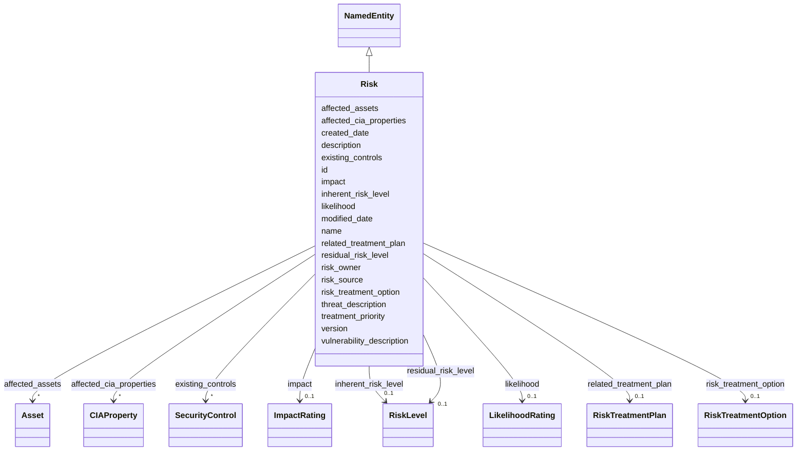

```mermaid
 classDiagram
    class Risk
    click Risk href "../Risk"
      NamedEntity <|-- Risk
        click NamedEntity href "../NamedEntity"
      
      Risk : affected_assets
        
          
    
        
        
        Risk --> "*" Asset : affected_assets
        click Asset href "../Asset"
    

        
      Risk : affected_cia_properties
        
          
    
        
        
        Risk --> "*" CIAProperty : affected_cia_properties
        click CIAProperty href "../CIAProperty"
    

        
      Risk : created_date
        
      Risk : description
        
      Risk : existing_controls
        
          
    
        
        
        Risk --> "*" SecurityControl : existing_controls
        click SecurityControl href "../SecurityControl"
    

        
      Risk : id
        
      Risk : impact
        
          
    
        
        
        Risk --> "0..1" ImpactRating : impact
        click ImpactRating href "../ImpactRating"
    

        
      Risk : inherent_risk_level
        
          
    
        
        
        Risk --> "0..1" RiskLevel : inherent_risk_level
        click RiskLevel href "../RiskLevel"
    

        
      Risk : likelihood
        
          
    
        
        
        Risk --> "0..1" LikelihoodRating : likelihood
        click LikelihoodRating href "../LikelihoodRating"
    

        
      Risk : modified_date
        
      Risk : name
        
      Risk : related_treatment_plan
        
          
    
        
        
        Risk --> "0..1" RiskTreatmentPlan : related_treatment_plan
        click RiskTreatmentPlan href "../RiskTreatmentPlan"
    

        
      Risk : residual_risk_level
        
          
    
        
        
        Risk --> "0..1" RiskLevel : residual_risk_level
        click RiskLevel href "../RiskLevel"
    

        
      Risk : risk_owner
        
      Risk : risk_source
        
      Risk : risk_treatment_option
        
          
    
        
        
        Risk --> "0..1" RiskTreatmentOption : risk_treatment_option
        click RiskTreatmentOption href "../RiskTreatmentOption"
    

        
      Risk : threat_description
        
      Risk : treatment_priority
        
      Risk : version
        
      Risk : vulnerability_description
        
      
```
