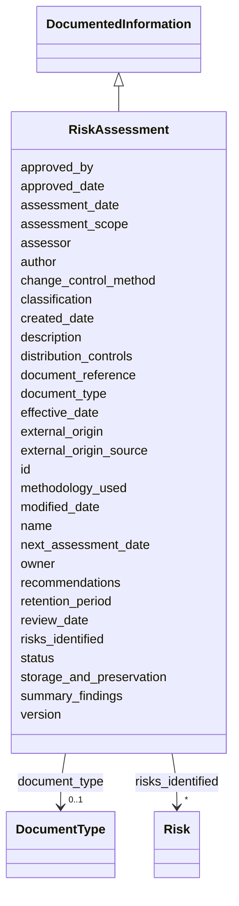

```mermaid
 classDiagram
    class RiskAssessment
    click RiskAssessment href "../RiskAssessment"
      DocumentedInformation <|-- RiskAssessment
        click DocumentedInformation href "../DocumentedInformation"
      
      RiskAssessment : approved_by
        
      RiskAssessment : approved_date
        
      RiskAssessment : assessment_date
        
      RiskAssessment : assessment_scope
        
      RiskAssessment : assessor
        
      RiskAssessment : author
        
      RiskAssessment : change_control_method
        
      RiskAssessment : classification
        
      RiskAssessment : created_date
        
      RiskAssessment : description
        
      RiskAssessment : distribution_controls
        
      RiskAssessment : document_reference
        
      RiskAssessment : document_type
        
          
    
        
        
        RiskAssessment --> "0..1" DocumentType : document_type
        click DocumentType href "../DocumentType"
    

        
      RiskAssessment : effective_date
        
      RiskAssessment : external_origin
        
      RiskAssessment : external_origin_source
        
      RiskAssessment : id
        
      RiskAssessment : methodology_used
        
      RiskAssessment : modified_date
        
      RiskAssessment : name
        
      RiskAssessment : next_assessment_date
        
      RiskAssessment : owner
        
      RiskAssessment : recommendations
        
      RiskAssessment : retention_period
        
      RiskAssessment : review_date
        
      RiskAssessment : risks_identified
        
          
    
        
        
        RiskAssessment --> "*" Risk : risks_identified
        click Risk href "../Risk"
    

        
      RiskAssessment : status
        
      RiskAssessment : storage_and_preservation
        
      RiskAssessment : summary_findings
        
      RiskAssessment : version
        
      
```
