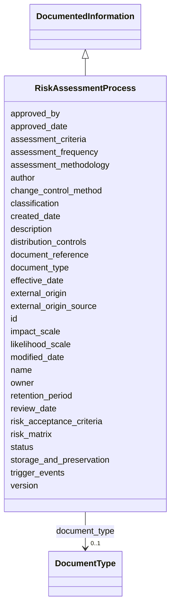

```mermaid
 classDiagram
    class RiskAssessmentProcess
    click RiskAssessmentProcess href "../RiskAssessmentProcess"
      DocumentedInformation <|-- RiskAssessmentProcess
        click DocumentedInformation href "../DocumentedInformation"
      
      RiskAssessmentProcess : approved_by
        
      RiskAssessmentProcess : approved_date
        
      RiskAssessmentProcess : assessment_criteria
        
      RiskAssessmentProcess : assessment_frequency
        
      RiskAssessmentProcess : assessment_methodology
        
      RiskAssessmentProcess : author
        
      RiskAssessmentProcess : change_control_method
        
      RiskAssessmentProcess : classification
        
      RiskAssessmentProcess : created_date
        
      RiskAssessmentProcess : description
        
      RiskAssessmentProcess : distribution_controls
        
      RiskAssessmentProcess : document_reference
        
      RiskAssessmentProcess : document_type
        
          
    
        
        
        RiskAssessmentProcess --> "0..1" DocumentType : document_type
        click DocumentType href "../DocumentType"
    

        
      RiskAssessmentProcess : effective_date
        
      RiskAssessmentProcess : external_origin
        
      RiskAssessmentProcess : external_origin_source
        
      RiskAssessmentProcess : id
        
      RiskAssessmentProcess : impact_scale
        
      RiskAssessmentProcess : likelihood_scale
        
      RiskAssessmentProcess : modified_date
        
      RiskAssessmentProcess : name
        
      RiskAssessmentProcess : owner
        
      RiskAssessmentProcess : retention_period
        
      RiskAssessmentProcess : review_date
        
      RiskAssessmentProcess : risk_acceptance_criteria
        
      RiskAssessmentProcess : risk_matrix
        
      RiskAssessmentProcess : status
        
      RiskAssessmentProcess : storage_and_preservation
        
      RiskAssessmentProcess : trigger_events
        
      RiskAssessmentProcess : version
        
      
```
