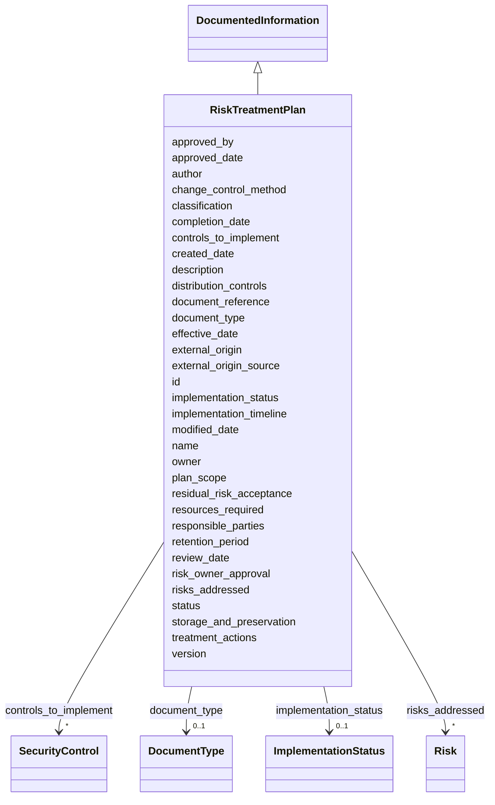

```mermaid
 classDiagram
    class RiskTreatmentPlan
    click RiskTreatmentPlan href "../RiskTreatmentPlan"
      DocumentedInformation <|-- RiskTreatmentPlan
        click DocumentedInformation href "../DocumentedInformation"
      
      RiskTreatmentPlan : approved_by
        
      RiskTreatmentPlan : approved_date
        
      RiskTreatmentPlan : author
        
      RiskTreatmentPlan : change_control_method
        
      RiskTreatmentPlan : classification
        
      RiskTreatmentPlan : completion_date
        
      RiskTreatmentPlan : controls_to_implement
        
          
    
        
        
        RiskTreatmentPlan --> "*" SecurityControl : controls_to_implement
        click SecurityControl href "../SecurityControl"
    

        
      RiskTreatmentPlan : created_date
        
      RiskTreatmentPlan : description
        
      RiskTreatmentPlan : distribution_controls
        
      RiskTreatmentPlan : document_reference
        
      RiskTreatmentPlan : document_type
        
          
    
        
        
        RiskTreatmentPlan --> "0..1" DocumentType : document_type
        click DocumentType href "../DocumentType"
    

        
      RiskTreatmentPlan : effective_date
        
      RiskTreatmentPlan : external_origin
        
      RiskTreatmentPlan : external_origin_source
        
      RiskTreatmentPlan : id
        
      RiskTreatmentPlan : implementation_status
        
          
    
        
        
        RiskTreatmentPlan --> "0..1" ImplementationStatus : implementation_status
        click ImplementationStatus href "../ImplementationStatus"
    

        
      RiskTreatmentPlan : implementation_timeline
        
      RiskTreatmentPlan : modified_date
        
      RiskTreatmentPlan : name
        
      RiskTreatmentPlan : owner
        
      RiskTreatmentPlan : plan_scope
        
      RiskTreatmentPlan : residual_risk_acceptance
        
      RiskTreatmentPlan : resources_required
        
      RiskTreatmentPlan : responsible_parties
        
      RiskTreatmentPlan : retention_period
        
      RiskTreatmentPlan : review_date
        
      RiskTreatmentPlan : risk_owner_approval
        
      RiskTreatmentPlan : risks_addressed
        
          
    
        
        
        RiskTreatmentPlan --> "*" Risk : risks_addressed
        click Risk href "../Risk"
    

        
      RiskTreatmentPlan : status
        
      RiskTreatmentPlan : storage_and_preservation
        
      RiskTreatmentPlan : treatment_actions
        
      RiskTreatmentPlan : version
        
      
```
