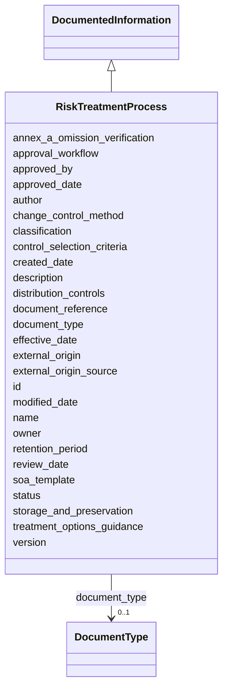

```mermaid
 classDiagram
    class RiskTreatmentProcess
    click RiskTreatmentProcess href "../RiskTreatmentProcess"
      DocumentedInformation <|-- RiskTreatmentProcess
        click DocumentedInformation href "../DocumentedInformation"
      
      RiskTreatmentProcess : annex_a_omission_verification
        
      RiskTreatmentProcess : approval_workflow
        
      RiskTreatmentProcess : approved_by
        
      RiskTreatmentProcess : approved_date
        
      RiskTreatmentProcess : author
        
      RiskTreatmentProcess : change_control_method
        
      RiskTreatmentProcess : classification
        
      RiskTreatmentProcess : control_selection_criteria
        
      RiskTreatmentProcess : created_date
        
      RiskTreatmentProcess : description
        
      RiskTreatmentProcess : distribution_controls
        
      RiskTreatmentProcess : document_reference
        
      RiskTreatmentProcess : document_type
        
          
    
        
        
        RiskTreatmentProcess --> "0..1" DocumentType : document_type
        click DocumentType href "../DocumentType"
    

        
      RiskTreatmentProcess : effective_date
        
      RiskTreatmentProcess : external_origin
        
      RiskTreatmentProcess : external_origin_source
        
      RiskTreatmentProcess : id
        
      RiskTreatmentProcess : modified_date
        
      RiskTreatmentProcess : name
        
      RiskTreatmentProcess : owner
        
      RiskTreatmentProcess : retention_period
        
      RiskTreatmentProcess : review_date
        
      RiskTreatmentProcess : soa_template
        
      RiskTreatmentProcess : status
        
      RiskTreatmentProcess : storage_and_preservation
        
      RiskTreatmentProcess : treatment_options_guidance
        
      RiskTreatmentProcess : version
        
      
```
