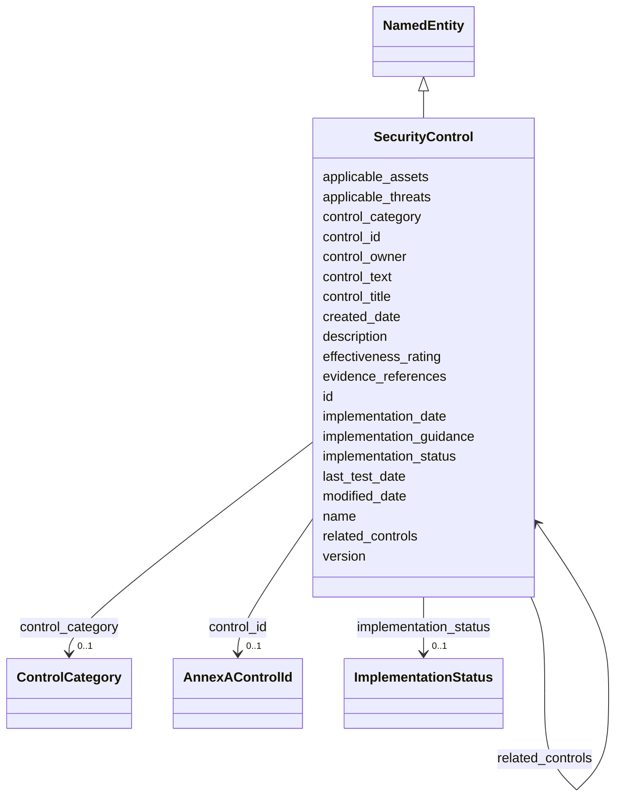

```mermaid
 classDiagram
    class SecurityControl
    click SecurityControl href "../SecurityControl"
      NamedEntity <|-- SecurityControl
        click NamedEntity href "../NamedEntity"
      
      SecurityControl : applicable_assets
        
      SecurityControl : applicable_threats
        
      SecurityControl : control_category
        
          
    
        
        
        SecurityControl --> "0..1" ControlCategory : control_category
        click ControlCategory href "../ControlCategory"
    

        
      SecurityControl : control_id
        
          
    
        
        
        SecurityControl --> "0..1" AnnexAControlId : control_id
        click AnnexAControlId href "../AnnexAControlId"
    

        
      SecurityControl : control_owner
        
      SecurityControl : control_text
        
      SecurityControl : control_title
        
      SecurityControl : created_date
        
      SecurityControl : description
        
      SecurityControl : effectiveness_rating
        
      SecurityControl : evidence_references
        
      SecurityControl : id
        
      SecurityControl : implementation_date
        
      SecurityControl : implementation_guidance
        
      SecurityControl : implementation_status
        
          
    
        
        
        SecurityControl --> "0..1" ImplementationStatus : implementation_status
        click ImplementationStatus href "../ImplementationStatus"
    

        
      SecurityControl : last_test_date
        
      SecurityControl : modified_date
        
      SecurityControl : name
        
      SecurityControl : related_controls
        
          
    
        
        
        SecurityControl --> "*" SecurityControl : related_controls
        click SecurityControl href "../SecurityControl"
    

        
      SecurityControl : version
        
      
```
