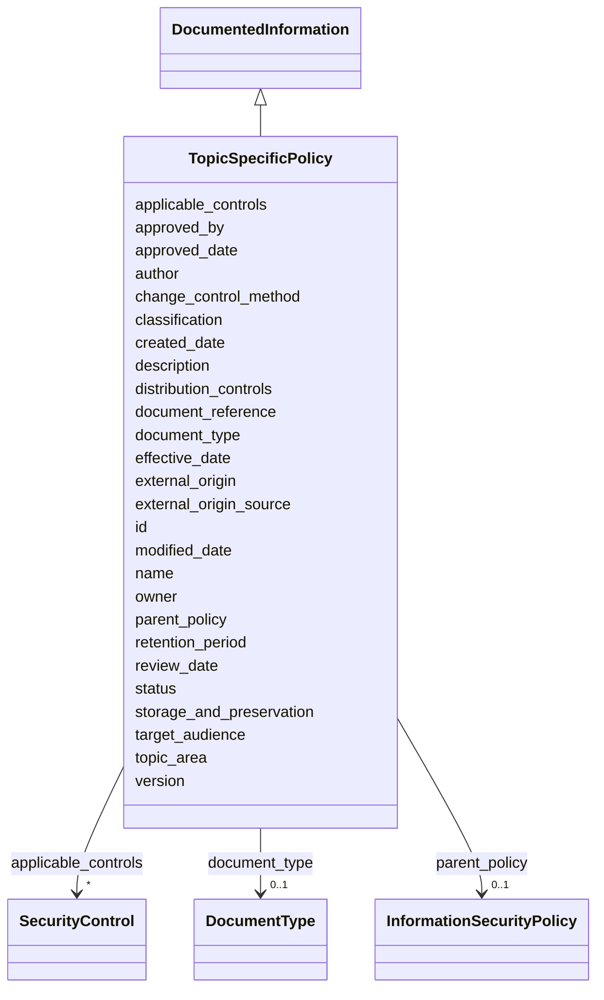

```mermaid
 classDiagram
    class TopicSpecificPolicy
    click TopicSpecificPolicy href "../TopicSpecificPolicy"
      DocumentedInformation <|-- TopicSpecificPolicy
        click DocumentedInformation href "../DocumentedInformation"
      
      TopicSpecificPolicy : applicable_controls
        
          
    
        
        
        TopicSpecificPolicy --> "*" SecurityControl : applicable_controls
        click SecurityControl href "../SecurityControl"
    

        
      TopicSpecificPolicy : approved_by
        
      TopicSpecificPolicy : approved_date
        
      TopicSpecificPolicy : author
        
      TopicSpecificPolicy : change_control_method
        
      TopicSpecificPolicy : classification
        
      TopicSpecificPolicy : created_date
        
      TopicSpecificPolicy : description
        
      TopicSpecificPolicy : distribution_controls
        
      TopicSpecificPolicy : document_reference
        
      TopicSpecificPolicy : document_type
        
          
    
        
        
        TopicSpecificPolicy --> "0..1" DocumentType : document_type
        click DocumentType href "../DocumentType"
    

        
      TopicSpecificPolicy : effective_date
        
      TopicSpecificPolicy : external_origin
        
      TopicSpecificPolicy : external_origin_source
        
      TopicSpecificPolicy : id
        
      TopicSpecificPolicy : modified_date
        
      TopicSpecificPolicy : name
        
      TopicSpecificPolicy : owner
        
      TopicSpecificPolicy : parent_policy
        
          
    
        
        
        TopicSpecificPolicy --> "0..1" InformationSecurityPolicy : parent_policy
        click InformationSecurityPolicy href "../InformationSecurityPolicy"
    

        
      TopicSpecificPolicy : retention_period
        
      TopicSpecificPolicy : review_date
        
      TopicSpecificPolicy : status
        
      TopicSpecificPolicy : storage_and_preservation
        
      TopicSpecificPolicy : target_audience
        
      TopicSpecificPolicy : topic_area
        
      TopicSpecificPolicy : version
        
      
```
